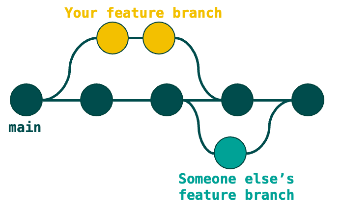
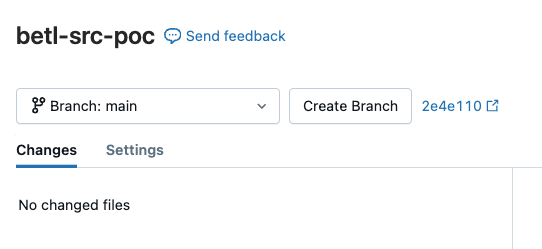
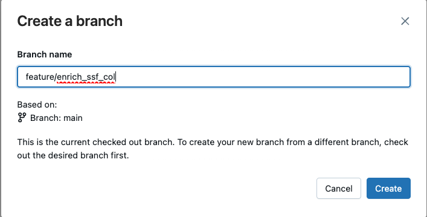
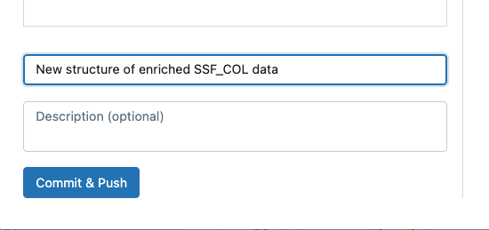

# Instruction

In this PoC, the data preprocessing is driven by YAML file, containing metadata about
- `description`: This is a quick summary of the YAML
- `target`: This is the name of the target output table in Databricks Unity Catalog
- `sources`: List if sources, including aliases with column selection and (optionally) additional filters
- `transformations`: Optional list of sequential transformations (join, add_variables, pivot, union, aggregation), using the input from the sources
- `expressions`: List of expressions in SQL, refering to aliased source tables and the corresponding columns
- `filter_target`; Optional list of filters after deriving the attributes by the list of expressions
- `drop_duplicates`: Optional boolean, If True deduplicate the final output table 


In the YAML we are using placeholders for binding
parameters, for instance the year-month run id or the delivery entity for reusable logic. 

```yaml
schema_{{ RUN_MONTH }}.table_{{ DELIVERY_ENTITY }}
```

In the processing scripts, the YAML file is parsed with corresponding input parameters, like the example below:

```python
business_logic_dict = parse_yaml(
    yaml_path="business_logic/enrichment/bcr_cpty_output",
    parameters={"RUN_MONTH": "202501"},
)
```

With corresponding (simplified) YAML meta sheet

```yaml
target: enrich_{{ RUN_MONTH }}.bcr_cpty_output

sources:
  - alias: EPR_ENT_PARTY
    columns:
    - o_GLOBAL_ID
    - o_SNAPSHOTDATE
    - o_PRTY_TYP
    - o_PRTY_NM
    source: int_{{ RUN_MONTH }}.enterprise_party_delt
...
  - alias: EPR_CLASS_VAL
    columns:
    - o_GLOBAL_ID
    - o_CLSFCTN_TYP
    - o_CLSFCTN_VAL
    filter: o_CLSFCTN_STS = 1  and o_CLSFCTN_TYP = 18
    source: int_{{ RUN_MONTH }}.epr_party_classification_delt

transformations:
  - join:
      left_source: EPR_ENT_PARTY
      right_source: EPR_ORG
      condition:
      - EPR_ENT_PARTY.o_GLOBAL_ID = EPR_ORG.o_GLOBAL_ID
      how: left
  ...
  - add_variables:
      column_mapping:
        var_expiry_date: dateadd(year, 1, to_date(EPR_ENT_PARTY.o_SNAPSHOTDATE, "yyyymmdd"))
        var_expired: case when var_expiry_date < getdate() then TRUE else FALSE end
  ...
  - aggregation:
      alias: EPR_ENT_PARTY_AGG
      group: 
      - EPR_ENT_PARTY.o_GLOBAL_ID
      column_mapping:
        max_epr_class_value: max(EPR_CLASS_02_NACE.o_CLSFCTN_VAL)
  ...
  - join:
      right_source: EPR_CLASS_VAL
      condition:
      - EPR_ENT_PARTY_AGG.o_GLOBAL_ID = EPR_CLASS_VAL.o_GLOBAL_ID
      how: left

expressions:
  CounterpartyName: EPR_ENT_PARTY.o_PRTY_NM
  CountryOfIncorporation: EPR_ORG.o_CNTRY_OF_INCORP
  CountryOfResidence: case when EPR_ADDRESS_PREF.o_ADRES_TYPE = 'PREF' then EPR_ADDRESS_PREF.o_CNTRY end
  ...
  REAL_SBI_CODE: case when EPR_CLASS_SBI_03.o_CLSFCTN_TYP = 3 then EPR_CLASS_SBI_03.o_CLSFCTN_VAL end
  SnapshotDate: EPR_ENT_PARTY.o_SNAPSHOTDATE
  UltimateParentOrganisation: EPR_ENT_PARTY_UP.o_GLOBAL_ID
  Expired: case when var_expired then var_expiry_date end

filter_target:
- Expired > SnapshotDate
```

## Sources

In the `sources` section you have to specify the source table, the new alias
and the selection of columns. The `source` should not contain the catalog name.

If no column list is specified, all columns are selected from the source.

Any filters directly on source data can already be applied here.

```yaml
sources:
  - alias: <alias of intermediate table A>
    columns:
    - <column name a1>
    - <column name a2>
    ...
    - <column name aN>
    source: <name of source table in unity catalog (schema.table)>
    filter: <optional filter on source data in SQL syntax>
  - alias: <alias of intermediate table B>
    source: <name of source table in unity catalog (schema.table)>
    filter: <optional filter on source data in SQL syntax>
```

## Transformations

In the `transformations` section you have to specify the sequential transformation steps.
The following transformation types are supported:
- Join
- Add variables
- Aggregation
- Pivot
- Union
- Filter

The transformations section is optional, for one-to-one mappings it can be skipped.

### Generic transformation information
#### Alias
For all transformations you have the option to specify an `alias` key. If specified, the resulting dataset will be saved in the list of sources under that alias. This means that you can use it by that name in any later steps.
For pivot and aggregation the alias is mandatory.

If you do not specify an alias, you can only use the data directly as source for the next step. This is still possible when you specify an alias.

Note: when specifying an alias, all prefixes in the column names change to that alias. E.g. if you join TBLA and TBLB without alias, the columns in the resulting dataframe will be called `TBLA.column` and `TBLB.column`. But if you specify `alias: TBLC` then all columns will be called `TBLC.column`.

#### Source
For all transformations it is possible to specify a source by its alias. This can be a source from your original sources list, or an alias you specified in an earlier transformation step. If no source is specified, the output from the previous step is used.

The first transformation always requires a source, because there is no previous transformation output.

Note: in joins this is called `left_source` instead of `source`.


### Joins
The most common transformation step is a join of two datasets.

This step contains:
- `alias`: Optional alias to save resulting dataset in the list of sources
- `left_source`: Alias of source used on left side of join, Optional unless it's the first transformation
- `right_source`: Alias of source used on right side of join
- `condition`: List of conditions in SQL syntax
- `how`: Join type, e.g. inner, Optional, default=left

```yaml
transformations:
  - join:
      left_source: TBL_A
      right_source: TBL_B
      condition: 
        - TBL_A.col01 = TBL_B.col01
        - TBL_A.col02 = TBL_B.col02 or TBL_B.col02 = '*'
      how: inner
```

The result of these two joins will be a dataframe with the fields `TBL_A.col01`, `TBL_A.col02`, ..., `TBL_A.col..`, `TBL_B.col01`, `TBL_B.col02`, ..., `TBL_B.col..`.

**Note**

The `left_source` in the join mapping is mandatory if it is the first transformation step.
For later transformation steps: If `left_source` is not specified the join will use the transformed dataset, the result of all previous transformation steps, as left source. If specified, it will take the source from the list of sources.

### Add variables
It can be useful to save logic into a variable. For example when it is used in multiple expressions, or required in a next transformation. A variable is essentially an extra column, derived based on the specified logic.

This step contains:
- `alias`: Optional alias
- `source`: Optional source
- `column_mapping`: Mapping of the variable names with the SQL expressions to derive them

 ```yaml
 transformations:
    - add_variables:
        column_mapping:
          var_minimum: min(TBL_A.col01) over (partition by TBL_A.ID)
          var_threshold: case when var_minimum>0 then TRUE else FALSE end
 ```
 
Note that variables are derived one by one, so you can use a previous variable in the expression for the next one.
Unless you specify an alias, variable columns do not have a prefix. 

### Pivot
You can pivot data, for example when you have key value pairs (with a key/type column and a value column) and you want to transpose those into a column per key containing the value. 


This step contains:

- `group_cols`: Columns to group data before pivoting
- `pivot_col`: Name of the column to pivot
- `pivot_value_col`: Column name of values for new columns
- `column_mapping`: Mapping of column of values that will be translated to
                columns in the output DataFrame with aggregation function
- `alias`: Alias of the pivoted dataset. This dataset is added to the original sources, and can be used in any join condition or any other data transformation.
- `source`: Source alias, mandatory if it is the first transformation step.

**Note**

For a comprehensive list of supported aggregation functions, refer to the [Spark documentation](https://spark.apache.org/docs/3.5.3/sql-ref-functions-builtin.html#aggregate-functions). 

```yaml
sources:
  - alias: TBL_A
    columns:
    - col01
    - col02
    - col03
    source: table_a
  - alias: TBL_B
    columns:
    - col01
    - col04
    source: table_b

transformations:
  - join:
      left_source: TBL_A
      right_source: TBL_B
      condition: 
        - TBL_A.col01 = TBL_B.col01
      how: left-outer
  - pivot:
      alias: TBL_PIVOT
      group_cols: ['TBL_A.col01', 'TBL_A.col02']
      pivot_col: TBL_B.col04
      pivot_value_col: TBL_A.col03
      column_mapping:
        X: min
        Y: min
        Z: min
```

This will give an output dataset containing columns

- `TBL_PIVOT.col01`, `TBL_PIVOT.col02`, `TBL_PIVOT.X`, `TBL_PIVOT.Y` and `TBL_PIVOT.Z`. 

### Aggregation

This step contains

- `alias`: Alias of the aggregated dataset. This dataset is added to the original sources, and can be used in any join condition or data transformation.  
- `group`: List of columns to group the data
- `column_mappings`: mapping of columns and the aggregation function. Use column aliases as keys and SQL expressions as values.
- `source`: Source alias, mandatory if it is the first transformation step.


```yaml
transformations:
  - join:
      left_source: TBLA
      right_source: TBLB
      condition: 
        - TBLA.col01 = TBLB.col01
      how: left
  - aggregation:
      alias: TBL_AGG
      group:
      - TBLA.col01
      column_mapping:
        whatever_name_you_want: max(TBLA.col02)
        do_not_use_dots_in_alias: first(TBLB.col03)
        avg_TBLB_col04: avg(TBLB.col04)
```

This will give an output dataset containing renamed columns

- `TBL_AGG.col01`, `TBL_AGG.whatever_name_you_want`, `TBL_AGG.do_not_use_dots_in_alias`, `TBL_AGG.avg_TBLB_col04`

**Note**: 

- This aggregation step is optional and not required as transformation step
- If you want to use aggregated datasets in a join with other sources, you can specify all
aggregated datasets at the beginning of the transformation steps. 
- For a comprehensive list of supported aggregation functions, refer to the [Spark documentation](https://spark.apache.org/docs/3.5.3/sql-ref-functions-builtin.html#aggregate-functions). 

### Union
This step contains

- `alias`: Name of union dataset
- `column_mapping`: list of input tables for the union or a list of mappings with underlying column mappings
- `allow_missing_columns`: True if missing columns are alowed in one of the underlying union tables. Default `False`


```yaml
sources:
  - alias: TBL_B
    columns:
    - col01
    - col04
    source: table_b
  - alias: TBL_C
    columns:
    - col01
    - col05
    - col06
    source: table_c

transformations:
  - union:
      alias: TABLE_B_C
      column_mapping:
        - TABLE_B:
            col01: cast(col01 as string)
            col04: col04   
        - TABLE_C:
            col01: col01          
            col04: col05 / col06
```

In this example, two tables are vertically stacked based on columns `col01` and `col02`.
Then the new table `TABLE_B_C` is added to the list of sources' configuration.
Note that the column keys on the union data level should be the same for all source
data sets. For instance, like the example above `col01` and `col02` for source `TABLE_B`
and `TABLE_C` to union to `TABLE_B_C`. 

An alternative approach:

```yaml
sources:
  - alias: TBL_B
    columns:
    - col01
    - col04
    source: table_b
  - alias: TBL_C
    columns:
    - col01
    - col04
    - col05
    source: table_c

transformations:
  - union:
      alias: TABLE_B_C
      column_mapping:
      - TABLE_B
      - TABLE_C
      # Required since not all columns are the same for input sources
      allow_missing_columns: true
```

In this example, two tables are vertically stacked based on columns `col01`,  `col04` and `col05`.
Note that the `col05` does not exist in `TABLE_B`, so these values are filled with `null`. 

If `allow_missing_columns` parameter is set to `false` the pipeline will fail in this example.

### Filter
This step contains
- `alias`: Alias of filtered dataset
- `conditions`: List of conditions to filter data

It can be used to filter in between transformations.

```yaml
transformations:
  - join:
      right_source: TBLB
      condition: 
        - TBLA.col01 = TBLB.col01
      how: left
  - filter:
      alias: FILTERED_TBL
      conditions:
        - TBLA.col02 <> TBLB.col02
  - join: ...
```

## Expressions

After the transformations a list of expressions in SQL syntax should be provided to derive the target columns.

```yaml
expressions:
  OutputColumnName1: TBLA.col1
  OutputColumnName2: 0
  OutputColumnName3: case when TBLC.col3 = 'YES' then TBLB.col02 end
```
Note: expressions are evaluated all at once, so it is not possible to use one column in the expression of a next one.
Use variables for this instead.

## Drop duplicates

After the expressions there is an option drop the duplicate records of the output table.

```yaml
drop_duplicates: true
```
This key is optional, by default the duplicates are not dropped.

## Filter target

After the expressions there is an option to specify a list of filters to apply on the target columns. These filters should be written as SQL expressions.

```yaml
filter_target:
- OutputColumnName1 IN (1,3,4)
- OutputColumnName3 = 5
```


## Template

### Git for version management
In this project, IT developers work with Git. Git is a tool that helps you manage changes to your code over time. 
It keeps track of every little change or update you make, you can always look back at previous versions or undo mistakes if needed. 
It also helps to contribute to collaborate on same project.



As a business developer, and in case you want to upload your own YAML file, some basic knowledge of Git is required.
In your Databricks workspace, you do not need to know all these commands, since you can use the UI for that:

- `git clone <repo_link_url>`: With this command you can clone the repository to your local workspace. 
- `git checkout -b <feature_branch_name>`: With this command you branch off the `main` branch, so developers can work independently from the production branch. d
- `git status`: Check the status of changed files in your local workspace. In case any of the files has changed they are refered as `'Changes not staged for commit:'`
- `git add <file_name>`: Add files to commit to your current branch
- `git commit -m "<your message>"`: Commit the changes to your current branch
- `git push origin <feature_branch_name>`: Push the feature branch to the remote repository in Azure DevOps

In case you want to update the latest changes in your own (local) git, make sure you `pull` the latest changes

```zsh
git pull
```

In the UI of Databricks, you can simply click on the `pull` button.

In case you want to more about Git, check the [official documentation](https://git-scm.com/book/en/v2/Getting-Started-What-is-Git%3F)

### How to work with the template
All steps above are listed in the [template](https://dev.azure.com/cbsp-abnamro/GRD0001018/_git/betl-src-poc?path=/business_logic/template.yml). 

- What is the output schema? (`staging`, `integration` or `enrichment`)
- Create a feature branch, for instance for the enrichment layer for the `ssf_col` data
  - With Git: 
    ```zsh
    git checkout -b feature/enrich_ssf_col
    ```
  - In the user interface of Databricks:

    

    

    

- Navigate to `./business_logic/<schema>`
- Copy and rename (for example to `int_ssf_col.yml`) the [template](https://dev.azure.com/cbsp-abnamro/GRD0001018/_git/betl-src-poc?path=/business_logic/template.yml) YAML to the navigated schema folder.
You can test and create your YAML files here. Changes in your own workspace will not impact central repository.
- Fill the template, and remove the sections that are not required
- If you are using Git, make sure you push the changes to Azure DevOps
  - With Git: 
    ```zsh
    git add business_logic/enrichment/enrich_ssf_col.yml
    git commit -m "New structure of enriched SSF_COL data"
    git push origin feature/enrich_ssf_col
    ```
  - Or in the user interface of Databricks:

    

- Start the DB notebook (pull the changes in case of Git) and select the right input YAML!
- Run the script

